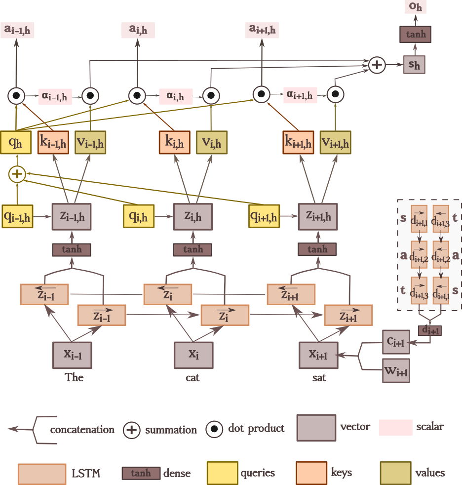

# Joint text classification on multiple levels with multiple labels

This repository contains the implementation of my multi-head attention labeller (MHAL) performing joint text classification on multiple levels (i.e. both at the sentence level and at the tokens level) with multiple labels. My model is an instance of multi-task learning -- it uses hard parameter sharing to train two tasks at different layers in the architecture. The token-level predictions are directly extracted from the attention evidence scores and are thus wired to the sentence representations.

Due to the design of its architecture, MHAL can also perform reasonably well on zero-shot sequence labelling tasks, simply through the supervision signal received on sentences. This means that it can assign a label to each individual token solely based on the sentence label. For instance, given a sentence like "John Smith lives in Cambridge" whose label is 1 (meaning that it contains named entities) MHAL can label "John Smith" as a person and "Cambridge" as a location. My model is robust and general, so it can perform this for many tasks. We tested it on named entity recognition, hedge detection, sentiment analysis and grammatical error detection.

## How does it work?

There are two main components:
- Bi-LSTMs operating on characters and words, extracting representations for each token
- a multi-head attention mechanism, tying the token and sentence predictions together

We provide a schematic overview below, for one head *h* only.



The main objectives are to train the model as a joint text classifier, but we also introduced some auxiliary objectives:
- char and/or word-based language modelling objectives
- an auxiliary loss, imposing that the attention weights reflect the ground truth of the sentence
- a query regularisation term, imposing distinct subspaces for each label in the tagset

## Requirements

* [Python](https://www.python.org/downloads/) (tested with 3.5.2)
* [Tensorflow](https://www.tensorflow.org/install) (tested with 1.13.1)
* [numpy](https://github.com/numpy/numpy)
* [pandas](https://pandas.pydata.org/pandas-docs/stable/install.html)
* [tqdm](https://github.com/tqdm/tqdm)
* some pre-trained word embeddings (I use [Glove](https://www.aclweb.org/anthology/D14-1162), which can be downloaded from [here](https://nlp.stanford.edu/projects/glove/))

## Intructions

For the main MHAL model, run:

```bash
    python3 experiment.py conf/example_of_config.conf
```

We also provide a wide range of variants. Most of them are just experimental work and have not been tested thoroughly. However, if you'd like to try any of the variants, I provide the config file. Make sure you comment this line ```from model import Model``` and uncomment this line ```from variants import Model``` in *experiment.py*, and run:

```bash
    python3 experiment.py conf/example_of_config_for_variants.conf
```

## Data format

The training and test data is expected in standard CoNLL-type. There is one word per line, with an arbitrary number of tab-separated values. The first value must be the word, the last one is its label. Each sentence is separated by an extra empty line. If the sentence labels are also specified, then they precede all the constituent words and have to start with *sent_label* followed by an equal number of columns as the tokens, the last one being the sentence label. Here is an example of sentiment detection:

    I       O
    loved    P
    his     O
    performance    O
    sent_label       P

However, if the sentence label is not explicitly specified, an implicit binary labelling can be performed. For instance, the example from an error detection task given below will be assigned a *positive* (i.e. it is ungrammatical) sentence label:

    I    c
    was    c
    really    c
    disappointing    FORM
    in    FUNCTION
    many    c
    points    CONTENT
    .    c
    
## Configuration

Edit the values in config.conf as needed:

 * **load_pretrained_model** - Whether to load a pre-trained model or not (case in which a new one is trained)
 * **model_type** - Can be last, baseline, attention, or any name of a variant. 
 * **sentence_label** - Can be binary, majority or specified.
 * **default_label** - The most common (negative) label in the dataset. For example, the correct label in error detection or neutral label in sentiment detection. 
 * **token_labels_available** - Whether the token labels are available during training (e.g. for hedge detection they are not).
 * **plot_token_scores** - Whether to plot or not individual token scores as matplotlib figures.
 * **plot_predictions_html** - Whether to obtain visualizations for the attention weights and sentence predictions as html file.
 * **conll03_eval** - Set it to true when evaluating on CoNLL-2003 dataset, so the correct metric (span-sensitive) is picked out.
 * **to_write_filename** -  Path where to save the results.
 * **path_train** - Path to the training data, in CoNLL tab-separated format. Can contain multiple files, colon separated.
 * **path_dev** - Path to the development data, used for choosing the best epoch. Can contain multiple files, colon separated.
 * **path_test** - Path to the test file. Can contain multiple files, colon separated. 
 * **model_selector** - The development metric used as the stopping criterion. For example, it can be "f_score_micro_sent:high". You can specify more than one metric but the high/low should remain the last thing to be specified: e.g. "f_score_micro_tok:f_score_micro_sent:high" will optimize the dev micro f-score both on tokens and on sentences.
 * **model_selector_ratio** - The ratio between the various model selectors specified in "model_selector" separated by ":". Should be either one ratio (in which case, each model selector will have the same weight), or a total of ratio numbers equal to the number of model selectors specified by "model_selector". The ratios are implicitly normalized so that the sum of the ratios are linear combinations and add up to 1. e.g. 2:1 for the previous model selector will put a wight of 0.666 on the dev micro f-score of the tokens, and a weight of 0.333 on the dev micro f-scores of the sentences. 
 * **preload_vectors** - Path to the pre-trained word embeddings.
 * **word_embedding_size** - Size of the word embeddings used in the model.
 * **emb_initial_zero** - Whether word embeddings should be initialized with zeros. Otherwise, they are initialized randomly. If 'preload_vectors' is set, the initialization will be overwritten either way for words that have pretrained embeddings.
 * **train_embeddings** - Whether word embeddings are updated during training.
 * **char_embedding_size** - Size of the character embeddings.
 * **word_recurrent_size** - Size of the word-level LSTM hidden layers.
 * **char_recurrent_size** - Size of the char-level LSTM hidden layers.
 * **hidden_layer_size** - Final hidden layer size, right before word-level predictions.
 * **char_hidden_layer_size** - Char-level representation size, right before it gets combined with the word embeddings.
 * **lowercase** - Whether words should be lowercased.
 * **replace_digits** - Whether all digits should be replaced by zero.
 * **min_word_freq** - Minimal frequency of words to be included in the vocabulary. Others will be considered OOV.
 * **singletons_prob** - The probability with which words that occur only once are replaced with OOV during training.
 * **allowed_word_length** - Maximum allowed word length, clipping the rest.
 * **max_train_sent_length** - Discard sentences in the training set that are longer than this.
 * **vocab_include_devtest** - Whether the loaded vocabulary includes words also from the dev and test set. Since the word embeddings for these words are not updated during training, this is equivalent to preloading embeddings at test time as needed.
 * **vocab_only_embedded** - Whether to only include words in the vocabulary if they have pre-trained embeddings.
 * **initializer** - Method for random initialization. Choose between normal, glorot, and xavier.
 * **opt_strategy** - Optimization strategy used. Choose between adam, adadelta, and sgd.
 * **learning_rate** - Learning rate. 
 * **clip** - Gradient clip limit.
 * **batch_equal_size** - Whether to construct batches from sentences of equal length.
 * **max_batch_size** - Maximum batch size.
 * **epochs** - Maximum number of epochs to run.
 * **stop_if_no_improvement_for_epochs** - Stop if there has been no improvement for this many epochs.
 * **learning_rate_decay** - Learning rate decay when performance hasn't improved.
 * **dropout_input** - Apply dropout to word representations.
 * **dropout_word_lstm** - Apply dropout after the LSTMs.
 * **dropout_attention** - Apply dropout after computing the attention weights (i.e. after softmax) in the transformer architecture.
 * **tf_per_process_gpu_memory_fraction** - Set 'tf_per_process_gpu_memory_fraction' for TensorFlow.
 * **tf_allow_growth** - Set 'allow_growth' for TensorFlow
 * **lm_cost_max_vocab_size** - Maximum vocabulary size for the language modeling objective.
 * **lm_cost_hidden_layer_size** - Hidden layer size for LMCost.
 * **lm_cost_lstm_gamma** - LMCost weight
 * **lm_cost_joint_lstm_gamma** - Joint LMCost weight
 * **lm_cost_char_gamma** - Char-level LMCost weight
 * **lm_cost_joint_char_gamma** - Joint char-level LMCost weight
 * **char_integration_method** - Method for combining character-based representations with word embeddings.
 * **save** - Path for saving the model.
 * **garbage_collection** - Whether to force garbage collection.
 * **lstm_use_peepholes** - Whether LSTMs use the peephole architecture.
 * **whidden_layer_size** - Hidden layer size after the word-level LSTMs.
 * **attention_evidence_size** - Layer size for predicting attention weights.
 * **attention_activation** - Type of activation to apply for attention weights. 
 * **enable_label_smoothing** - Whether to enable label smoothing in the attention objective weigth or not.
 * **smoothing_epsilon** - The value of the epsilon in the label smoothign formula. Has no effect if label smoothing is not set.
 * **sentence_objective_weights_non_default** - How much weight to put on sentences of non-default type. 
 * **sentence_objective_weight** - How much weight to put on the sentence classification (main) loss.
 * **word_objective_weight**  - How much weight to put on the sequence labelling (main) loss.
 * **type1_attention_objective_weight** - How much weight to put on the first type of attention loss. This pushes the maximum head corresponding to the correct sentence label to be the highest, while tempering the other maximum heads.
 * **type2_attention_objective_weight** - How much weight to put on the first type of attention loss. This encourages the network to make the two predicted distributions (over the tokens and the sentences) similar.
 * **type3_attention_objective_weight** - How much weight to put on the first type of attention loss. This tells the network that at least one token has a label corresponding to the true sentence label.
 * **type4_attention_objective_weight** - How much weight to put on the first type of attention loss. This tells the network that a sentence that has a default label, should only contain tokens labeled as default.
 * **type5_attention_objective_weight** - How much weight to put on the first type of attention loss. This tells the network that every sentence has at least one default label.
 * **type6_attention_objective_weight** - How much weight to put on the first type of attention loss. This is a pairwise attention objective function.
 * **type7_attention_objective_weight** - How much weight to put on the first type of attention loss. This uses KL divergence to make the distribution over tokens similar to the distribution over sentences.
 * **regularize_queries** - How much weight to put on the query regularisation term.
 * **regularize_keys** - How much weight to put on the query regularisation term.
 * **regularize_values** - How much weight to put on the query regularisation term.
 * **regularize_sentence_repr** - How much weight to put on the query regularisation term.
 * **take_abs** - Whether to take the absolute value in the calculation of the cosine similarity. Has no effect if none of the regularisation terms is set.
 * **gap_objective_weight** - How much weight to put on the  gap-distance loss. This encourages a distance between the maximum default and maximum non-default heads.
 * **maximum_gap_threshold** - The difference between the default and non-default heads should be at least as big as this value. Has no effect if the gap_objective_weight was not set to a positive value.
 * **random_seed** - Random seed.

## Acknowledgements and references

I would like to thank my supervisor, Dr Marek Rei, for inspiring this project and guiding me throughout. The code in this repository has largely been structured based on his other two projects: [sequence-labeler](https://github.com/marekrei/sequence-labeler) and [mltagger](https://github.com/marekrei/mltagger).

[**Jointly Learning to Label Sentences and Tokens**](https://arxiv.org/pdf/1811.05949.pdf) by Marek Rei and Anders Søgaard (2019)

[**Zero-Shot Sequence Labeling: Transferring Knowledge from Sentences to Tokens**](https://www.aclweb.org/anthology/N18-1027)  by Marek Rei and Anders Søgaard (2018)

[**Semi-supervised Multitask Learning for Sequence Labeling**](https://arxiv.org/abs/1704.07156) by Marek Rei (2017)

[**Attention Is All You Need**](https://arxiv.org/pdf/1706.03762.pdf) by Ashish Vaswani et al. (2017)

[**Neural Architectures for Named Entity Recognition**](https://www.aclweb.org/anthology/N16-1030) by Lample et al. (2016)

## License
Everything is licensed under the MIT license.
