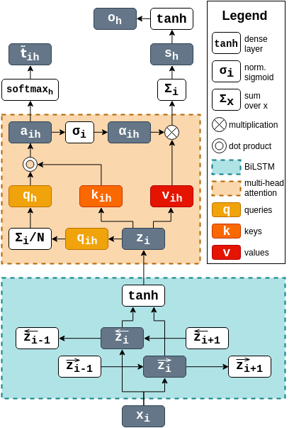

# MHAL, a multi-head attention labeller

This repository contains our Tensorflow implementation for MHAL, a multi-head attention labeller that performs joint text classification on multiple compositional levels (i.e., both at the sentence and world level). 

MHAL is an instance of multi-task learning; it uses hard parameter sharing to perform two tasks: sequence labelling and sentence classification. By design, these two tasks are intertwined and learned jointly. The token-level predictions are directly extracted from the attention evidence scores, which are in turn used to build sentence-level representations and predictions. 

Due to its architectural design and the fluid transfer of knowledge between compositional levels, MHAL can be instantiated (and perform reasonably well) as a *zero-shot sequence labeller*. This means that, without receiving any supervision signal on the sentence-level, MHAL can perform sophisticated word-level classifications. For instance, given a sentence like "John Smith lives in Cambridge" whose label is, say, "E" (meaning that it contains named entities) MHAL can label "John Smith" as a person and "Cambridge" as a location (see visualizations of this task below). 

MHAL is a robust and versatile model. It extracts knowledge at different levels of granularity and fluidly transfers it between tasks. 

## Abstract

Our paper "Seeing Both the Forest and the Trees: Multi-head Attention for Joint Classification on Different Compositional Levels" (by Miruna Pislar and [Marek Rei](https://www.marekrei.com/)) has been published at [COLING 2020](https://coling2020.org/) (see citation instructions [at the bottom](#citation)).

In natural languages, words are used in association to construct sentences. It is not words in isolation, but the appropriate combination of hierarchical structures that conveys the meaning of the whole sentence. Neural networks can capture expressive language features; however, insights into the link between words and sentences are difficult to acquire automatically. In this work, we design a deep neural network architecture that explicitly wires lower and higher linguistic components; we then evaluate its ability to perform the same task at different hierarchical levels. Settling on broad text classification tasks, we show that our model, MHAL, learns to simultaneously solve them at different levels of granularity by fluidly transferring knowledge between hierarchies. Using a multi-head attention mechanism to tie the representations between single words and full sentences, MHAL systematically outperforms equivalent models that are not incentivized towards developing compositional representations. Moreover, we demonstrate that, with the proposed architecture, the sentence information flows naturally to individual words, allowing the model to behave like a sequence labeller (which is a lower, word-level task) even without any word supervision, in a zero-shot fashion.

## How does it work?

The architecture is based on BiLSTMs that builds contextual vector representations for each word. These vectors are then passed through a multi-head attention mechanism, which predicts label distributions for both individual words and the whole sentence. Each attention head is incentivized to be predictive of a particular label, allowing the system to also assign labels to individual words while composing a sentence-level representation for sentence classification.

In short, there are two main components:
- Bi-LSTMs operating on characters and words, extracting representations for each token
- a multi-head attention mechanism, tying the token and sentence predictions together

In the diagram below, we illustrate how MHAL is applied on one input word to compute one attention head *h*.



In addition to the standard NLL objectives for sentence classification and sequence labelling, MHAL makes use of some auxiliary objectives:
* a language modelling loss (configurable to be char and/or word-based) that facilitates the 'acquisition' of linguistic knowledge 
* an attention loss, to enable a fluid label transfer between compositional levels, ensuring that the attention weights reflect the ground truth of the sentence
* a regularization term that encourages the learning of sentence-averaged queries that are truly diverse across labels (so, it imposes the construction of a distinct subspace for each label in the tagset)

## Data and format

MHAL was tested on named entity recognition ([CoNLL-2003 dataset](https://github.com/synalp/NER/tree/master/corpus/CoNLL-2003)), sentiment analysis ([Stanford Sentiment Treebank dataset](https://nlp.stanford.edu/sentiment/)), and grammatical error detection ([FCE dataset](https://ilexir.co.uk/datasets/index.html)). For all of these datasets, annotations are available either 1) for both individual words and full sentences or 2) only for the words, but we can infer the labels for the sentences. See paper for details.

The training and test data is expected in standard CoNLL-type. There is one word per line, with an arbitrary number of tab-separated values. The first value must be the word, the last one is its label. Each sentence is separated by an extra empty line. If the sentence labels are also specified, then they precede all the constituent words and have to start with *sent_label* followed by an equal number of columns as the tokens, the last one being the sentence label. Here is an example of sentiment detection:

    I       O
    loved    P
    his     O
    performance    O
    sent_label       P

However, if the sentence label is not explicitly specified, an implicit binary labelling can be performed. For instance, the example from an error detection task given below will be assigned a *positive* (i.e. it is ungrammatical) sentence label:

    I    c
    was    c
    really    c
    disappointing    FORM
    in    FUNCTION
    many    c
    points    CONTENT
    .    c

## Requirements

* [Python](https://www.python.org/downloads/) (tested with 3.5.2)
* [Tensorflow](https://www.tensorflow.org/install) (tested with 1.13.1)
* [numpy](https://github.com/numpy/numpy)
* [pandas](https://pandas.pydata.org/pandas-docs/stable/install.html)
* [tqdm](https://github.com/tqdm/tqdm)
* some pre-trained word embeddings (I use [Glove](https://www.aclweb.org/anthology/D14-1162), which can be downloaded from [here](https://nlp.stanford.edu/projects/glove/))

## Intructions

For the main MHAL model, run:

```bash
    python3 experiment.py conf/example_of_config.conf
```

We also provide a wide range of variants. Most of them are just experimental work and have not been tested thoroughly. However, if you'd like to try any of the variants, I provide the config file. Make sure you comment this line ```from model import Model``` and uncomment this line ```from variants import Model``` in *experiment.py*, and run:

```bash
    python3 experiment.py conf/example_of_config_for_variants.conf
```

## Results

The experiments showed that supervision on both levels of granularity consistently outperformed models that were optimized only on one level.

We note two cool results:
* our **semi-supervised sequence labelling experiments** (where the model receives only partial labelling) show that MHAL performs very well while using only 30% to 50% of the token-annotated data (almost as well as a model trained on the full dataset annotations). See plots below, comparing MHAL-p% to a standard BiLSTM+attention sequence labeller.


* our **zero-shot sequence labelling experiments** (where the model needs to label tokens while only learning from the sentence-level annotation) show that MHAL, through the inductive bias introduced by our auxiliary losses, can transfer knowledge from the sentence level to the tokens even in this very challenging setting. See picture below for a visualization of the attention heads when MHAL is trained as a zero-shot sequence labeller.


### Main references (see paper for more)

[**Attention Is All You Need**](https://arxiv.org/pdf/1706.03762.pdf) by Ashish Vaswani et al. (2017)

[**Jointly Learning to Label Sentences and Tokens**](https://arxiv.org/pdf/1811.05949.pdf) by Marek Rei and Anders Søgaard (2019)

[**Zero-Shot Sequence Labeling: Transferring Knowledge from Sentences to Tokens**](https://www.aclweb.org/anthology/N18-1027)  by Marek Rei and Anders Søgaard (2018)

[**Semi-supervised Multitask Learning for Sequence Labeling**](https://arxiv.org/abs/1704.07156) by Marek Rei (2017)

### Citation

```
@inproceedings{,
  author = 	"Pislar, Miruna
		and Rei, Marek",
  title = 	"Seeing Both the Forest and the Trees: Multi-head Attention for Joint Classification on Different Compositional Levels",
  booktitle = 	"Proceedings of the 28th International Conference on Computational Linguistics: Technical Papers",
  year = 	"2020",
  publisher = 	"COLING 2020",
  pages = 	"3--3",
  url = {https://doi.org/}
}
```

## License
Everything is licensed under the MIT license.
